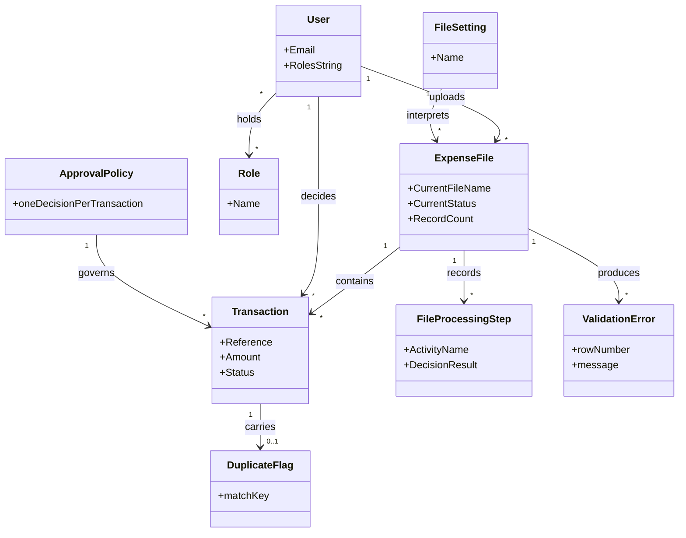

# Requirements: Employee Expenses

**Domain:** Internal finance operations — employee expense payment approval [SRC: C-002] **Target:** application **Created:** 2026-08-03 **Status:** final **Last finalised at:** 2026-08-03T08:19:34Z

## Export provenance

| Field | Value |
| --- | --- |
| Source document | `requirements/requirements.md` |
| Source sha256 | d7f201f7ce7b8b0210fb83a630e7dd5ad478aad5e07206d1eff26b7fbbe5063f |
| Source status / last finalised at | `final` / `2026-08-03T08:19:34Z` |
| Exported at | 2026-08-03T08:25:08Z |
| Produced by | `/export-application` — re-projection of the prototype-target document to the application audience. Zero improvised content: every net-new byte is either mechanical (paths, hash, timestamp) or a fixed literal; nothing is composed at export time. |
| Input recovery | none — this export adds no facts. Cells tagged `[SRC: C-NNN]` are input-grounded and grounding-verified; untagged cells were consultant-resolved, filled deterministically from framework standard rules, or domain-defaulted, and carry no input citation. |
| Known residue | none — no prototype-mode framing survived the projection. |
| Gate outcome | accepted |
| Citation legend | `[SRC: C-NNN]` = input-grounded claim; resolves against `requirements/draft-claims.ndjson` (verbatim source quotes) — include that file in any handoff bundle. `Supports/Enables/Enforces/Serves → §…` in §6.1 Rationale = derived cross-reference into the named section of this document. |
| Backend contract pointers | §6.10 uses the placeholder base `../backend/requirements.md` until a backend requirements document exists — rebind the base path on handoff. One pointer per operation; this document never restates the contract. |

> **Authoring guardrails.** Cells across §1–§10 must obey:
> - **No stack specifics.** No framework, library, vendor, product, version, or brand name in any cell. Speak in capability categories ("client-side state management", "binary blob storage tier"). Stack picks happen at code-generation time, not here.
> - **No UI layout.** §6.4 / §6.7 / §6.8 / §6.9 cells describe *what UI elements/behaviours must exist*, never *how they are arranged or styled*. Layout, component choice, and visual design are produced by a later UX design step. Exceptions: §5 may name screen-level navigation; §6.5 may describe role-conditional visibility; §8 may quote consultant-supplied layout observations as input citations.
>
> This is the finalised document. Every inferred value was carried through consultant resolution and its resolution marker has been stripped; the per-item record of what was confirmed, corrected or accepted lives in `requirements/consultant-answers.md`.
>
> Citation: input-grounded cells carry a trailing `[SRC: C-NNN]` tag in the draft, backed by `requirements/draft-claims.ndjson`. The merger **retains** `[SRC:]` tags in the final doc (LLM-only audience) and strips the three resolution markers above.
>
> Prototype-only content is wrapped in a paired **scope** span — a square-bracketed `PROTO-ONLY` delimiter opens it and a square-bracketed `/PROTO-ONLY` delimiter closes it — marking text that is true of the prototype and false or meaningless for the application build. This is a *different axis* from the three markers above (which answer "where did this value come from?"), so a span may contain a `[SRC: C-NNN]` tag and may sit alongside a resolution marker. The merger **retains** spans; `/export-application` deletes each one whole, which is what keeps that export a mechanical transform. A span never crosses a markdown block boundary, and never wraps a normative requirement — only a realization note about one. Canonical definition: `framework/shared/prototype-scope.md > Prototype-only content marking`.
>
> Field-level marking when only some sub-fields are inferred; heading-level marking when the whole item is invented. Fill every field — no blanks.

---

## 0.1 Document scope

This document is the application-audience projection of the source requirements. §1.7, §6.6.1 and §6.6.2 are advisory application-build guidance; §6.10 carries pointers into the sibling backend requirements document.

## 1. Application context

**Name:** Employee Expenses [SRC: C-001]

**Purpose / business value:** A central finance person uploads batches of ad-hoc employee expense payment requests as CSV files; between one and three approvers review the imported requests on a shared screen and record a single approval decision per request, after which an external system handles reimbursement. [SRC: C-003]

**Domain:** Internal finance operations — employee expense payment approval [SRC: C-002]

**Business goal:** Replace ad-hoc handling of employee expense payment requests with a single reviewed record: every request that reaches the external reimbursement system has been imported from a stored file, checked for duplicates, and approved exactly once. [SRC: C-004]

<!-- rev: run-1 2026-08-03 -->

---

## 1.5 Scope

> §1.5 is in-scope-only. Buckets the inputs did not supply were inferred and resolved with the consultant; out-of-scope domain defaults are **not** valid in this section (the section *defines* scope, so deferring it would be self-referential).

| Bucket | Items |
| --- | --- |
| In | CSV file upload [SRC: C-005], file validation feedback and retry [SRC: C-006], duplicate identification [SRC: C-007], transaction list with search and filtering [SRC: C-008], automatic refresh of the shared list [SRC: C-009], single-decision approval workflow [SRC: C-010], bulk approval [SRC: C-011], CSV export [SRC: C-012], credentials-based sign-in [SRC: C-013], retained input data [SRC: C-014] |
| Out | Editing of imported expense data [SRC: C-015], user and role administration [SRC: C-016], outbound reports [SRC: C-017], reimbursement execution [SRC: C-018], approval amount limits [SRC: C-019] |
| Deferred | Multi-step and threshold-based approval chains; per-approver assignment of requests |

<!-- rev: run-1 2026-08-03 -->

---

## 1.6 Assumptions & dependencies

> Abstract services, persona prerequisites, environment assumptions. Cells naming a product or vendor fail the no-stack-specifics rule. Omitted entirely when nothing applies (§0.1 content-conditional).

| Kind | Statement | Source |
| --- | --- | --- |
| Abstract service dependency | An external reimbursement system receives approved expense payment requests and pays them; this application never moves money itself. [SRC: C-018] | stated |
| Abstract service dependency | A credential store holds the small set of sign-in accounts; the authentication contract is credentials-only, with no external identity provider. [SRC: C-020] | stated |
| Abstract service dependency | A binary storage tier retains each uploaded file and each generated error file so both remain downloadable after processing. [SRC: C-021] | stated |
| Persona prerequisite | Between two and three named accounts exist in the credential store before first use; the application provides no way to create them. [SRC: C-022] | stated |
| Environment assumption | The consumed contract exposes no export operation, so the CSV export is produced from expense data already retrieved by the client. [SRC: C-012] | inferred |
| Environment assumption | Users work in a modern evergreen browser on a stable internal network connection; the shared list refreshes automatically while it is open. [SRC: C-009] | inferred |

<!-- rev: run-1 2026-08-03 -->

---

## 1.7 Architectural implications

> **Application-build guidance.** Capability categories derived by the drafter from §6 functional requirements + §10 volumes + §6.7 reporting needs, against an inline catalogue of ≤15 categories (see `framework/agents/requirements-drafter.md > derive-architectural-implications`). Drafter seeds every row as `[AI-SUGGESTED: AI-NNN | non-blocking]`; resolver Q&A refines. Recommendation column is **optional** and **non-deterministic** — a stack choice belongs in the code-generation step, not here.

| Capability category | Driving requirement(s) | Recommendation (optional) |
| --- | --- | --- |
| Client-side state management | → §6.1 F-12, → §6.1 F-20 | |
| Client-side search / filtering | → §6.1 F-13, → §6.1 F-14, → §10 Data volume | ≤10⁴ records → in-memory index acceptable |
| Real-time updates | → §6.1 F-20, → §6.7 RPT-01 | |
| File upload / binary blob handling | → §6.1 F-04, → §6.1 F-10, → §6.1 F-11 | binary blob storage tier required |
| Export rendering capability | → §6.1 F-21, → §6.7 RPT-01 | |
| Notification delivery surface | → §6.1 F-06, → §6.1 F-16 | every notification point in §6.8 is in-app; no outbound channel is mapped |
| Multi-tab / multi-window sync | → §6.1 F-20, → §10 Concurrency | |
| Audit-trail viewer | → §6.1 F-23, → §6.1 F-06 | |
| Role-conditional rendering | → §6.1 F-16, → §6.1 F-04 | |

<!-- rev: run-1 2026-08-03 -->

---

## 1.8 Application character

> The persona/voice of the application's **own user-facing copy** — notifications, error messages, validation messages, confirmations, empty states. Governs tone and phrasing only; what feedback exists, when it appears, and how it is structured remain governed by the standard feedback rules and the design pipelines. This is the application's voice toward its end users — not an agent character, and not a §3 persona.

**Selected character:** Exacting finance desk — states plainly what happened to a payment request, names the amount and reference involved, and never editorialises about money.
**Tone attributes:** precise, calm, plain-spoken, respectful of the reviewer's judgement

| Copy surface | Guidance | Example |
| --- | --- | --- |
| Notifications | Name the object and the outcome; give the count when more than one request is affected. | "18 expense requests imported from expenses-2026-08-03.csv." |
| Errors | Say what failed and what the user can do next; never blame the user. | "This file could not be validated. Download the error file to see which requests were rejected." |
| Validation | Name the field and the accepted form; keep the correction in the same sentence. | "Amount must be a number, for example 1245.67." |
| Confirmations | Restate the action and its scope before it is irreversible; name the count. | "Approve 12 selected expense requests? This cannot be undone." |
| Empty states | Name the object that is missing and offer the one action that resolves it. | "No expense requests yet. Upload a CSV file to import the first batch." |

<!-- rev: run-1 2026-08-03 -->

---

## 2. Domain model

> The BA's framing of the business domain in **ubiquitous language**, implementation-free.

### 2.1 Concepts

| Concept | Persistence | Definition (ubiquitous language) |
| --- | --- | --- |
| Transaction [SRC: C-023] | persistent | A single employee expense payment request imported from an uploaded file, carrying its own approval status. |
| Expense File [SRC: C-024] | persistent | A CSV batch of expense payment requests submitted by the finance uploader, tracked from upload through validation to import. |
| File Setting [SRC: C-025] | persistent | The named configuration that tells the system how to interpret an uploaded file. |
| File Processing Step [SRC: C-026] | persistent | One recorded activity in an expense file's processing history, with its outcome and timing. |
| User [SRC: C-027] | persistent | A person who can sign in to the application. |
| Role [SRC: C-028] | persistent | A named grouping held by a user that determines what that user may do. |
| Duplicate Flag [SRC: C-007] | derived | An indication that an imported transaction matches another transaction on the agreed duplicate key. |
| Validation Error [SRC: C-029] | derived | A defect found in one row of an uploaded file that prevents that row from being imported. |
| Approval Policy [SRC: C-010] | policy | The rule that any one of the approvers may decide a transaction and that exactly one approval is recorded per transaction. |

### 2.2 Relationships

- User **uploads** Expense File [1:N]
- File Setting **interprets** Expense File [1:N]
- Expense File **contains** Transaction [1:N]
- Expense File **records** File Processing Step [1:N]
- Expense File **produces** Validation Error [1:N]
- Transaction **carries** Duplicate Flag [1:0..1]
- User **decides** Transaction [1:N]
- User **holds** Role [N:M]
- Approval Policy **governs** Transaction [1:N]

### 2.3 Aggregates & lifecycles

#### Expense File

| Field | Value |
| --- | --- |
| Member concepts | Expense File, Transaction, Validation Error, File Processing Step |
| Lifecycle states | Uploaded → Validating → Validation failed → Imported → Cancelled [SRC: C-030] |
| Key invariants | A file whose rows have unresolved validation errors is not imported; a cancelled file's rows are removed from staging and its transactions never reach the transaction list. [SRC: C-031] |

#### Transaction

| Field | Value |
| --- | --- |
| Member concepts | Transaction, Duplicate Flag |
| Lifecycle states | Imported → Approved / Rejected [SRC: C-032] |
| Key invariants | Exactly one approval is recorded per transaction; a transaction may only be decided while it is Imported; a rejected transaction carries the deciding user's note. [SRC: C-010] |

### 2.4 Diagram (optional)

### 2.5 State-transition matrix

> Emitted only when ≥1 §2.3 aggregate has more than two lifecycle states. One sub-block per qualifying aggregate. Pre-condition cells may reference `→ §6.2 BR-NN`.

#### Expense File

| From → To | Trigger | Pre-condition | Visible effect |
| --- | --- | --- | --- |
| (none) → Uploaded | The finance uploader submits a CSV file [SRC: C-005] | → §6.2 BR-07 | The file appears in the file list with an in-progress status. |
| Uploaded → Validating | The system begins checking the submitted rows [SRC: C-029] | The file has been accepted for processing | The file's status changes and its most recent processing activity is shown. |
| Validating → Imported | Validation completes with no invalid rows [SRC: C-033] | → §6.2 BR-06 | The file's status changes to Imported and its transactions appear in the transaction list. |
| Validating → Validation failed | Validation finds one or more invalid rows [SRC: C-029] | → §6.2 BR-06 | The file's status shows the failure and an error file becomes downloadable. |
| Validation failed → Validating | The finance uploader retries validation [SRC: C-006] | The file has not been cancelled | The file returns to an in-progress status and a new processing activity is recorded. |
| Uploaded → Cancelled | The finance uploader cancels the file [SRC: C-034] | The file has not been imported | The file leaves the active file list. |
| Validation failed → Cancelled | The finance uploader cancels the file [SRC: C-034] | The file has not been imported | The file leaves the active file list. |

#### Transaction

| From → To | Trigger | Pre-condition | Visible effect |
| --- | --- | --- | --- |
| Imported → Approved | An approver approves the transaction [SRC: C-035] | → §6.2 BR-03 | The transaction's status indicator changes to Approved and the decide actions are no longer offered for it. |
| Imported → Rejected | An approver rejects the transaction with a note [SRC: C-036] | → §6.2 BR-04 | The transaction's status indicator changes to Rejected and the recorded note is shown with it. |

<!-- rev: run-1 2026-08-03 -->

---

## 3. Target users

> Target-user personas — the end users of the application being designed. Not to be confused with the Unicorn (LLM) or the Consultant (audience).

### Finance Uploader

| Field | Value |
| --- | --- |
| Role / job title | Central finance administrator responsible for submitting employee expense batches [SRC: C-037] |
| Expertise level | Fluent with the expense data and the file format; the single person who performs uploads [SRC: C-038] |
| Stakes | Owns the accuracy of what enters the system; a bad batch reaches the approvers and, once approved, the external reimbursement system [SRC: C-018] |
| Frequency of use | Daily — submits and monitors a file on most working days, with correction and resubmission handled the same day |
| Driving forces — wants | Get a whole batch in cleanly in one pass, see immediately which rows were rejected, and correct and resubmit without re-keying [SRC: C-006] |
| Driving forces — fears | Submitting the same expense twice, or shipping a batch that quietly failed validation [SRC: C-007] |

### Approver

| Field | Value |
| --- | --- |
| Role / job title | One of up to three people authorised to decide employee expense payment requests [SRC: C-039] |
| Expertise level | Trusted to judge each request on its merits — the decision is left to the approver [SRC: C-040] |
| Stakes | Their single decision releases a payment; there is no amount limit and no second reviewer [SRC: C-019] |
| Frequency of use | Whenever a batch has been imported and is awaiting decisions [SRC: C-009] |
| Driving forces — wants | See the same live list as the other approvers, find a request quickly, and clear a batch in bulk rather than one at a time [SRC: C-011] |
| Driving forces — fears | Duplicating another approver's work on the same request, or approving a duplicate expense [SRC: C-010] |

<!-- rev: run-1 2026-08-03 -->

---

## 4. User goals & stories

> Quality signals live on the goal (outcome-level), not the story (behaviour-level).

### 4.1 Goals catalogue

| ID | Goal statement | Quality signals | Goal kind | Layout pref (optional) | UX-pattern pref (optional) |
| --- | --- | --- | --- | --- | --- |
| G-01 | Get each batch of employee expense payment requests into the system accurately and without duplicates [SRC: C-007] | Every imported batch is either fully imported or has its rejected rows identified; possible duplicates are visible before any decision is taken | top-level | | |
| G-02 | Reach exactly one decision on every imported expense request without two approvers duplicating work [SRC: C-010] | No request is decided twice; approvers working simultaneously see each other's decisions without reloading | top-level | | |
| G-03 | Find a specific request, or a subset of requests, without reading the whole batch [SRC: C-008] | A known request is located by reference or description without paging through the batch | sub-level | | |
| G-04 | Hand the decided requests to the external reimbursement system as a file [SRC: C-012] | The exported file contains the decided requests and their statuses | sub-level | | |
| G-05 | Understand why a file or a row was rejected so it can be corrected and resubmitted [SRC: C-006] | The rejecting reason is available per row without contacting support | sub-level | | |
| G-06 | Sign in and out of the shared screen securely [SRC: C-013] | Only signed-in users reach the expense data; signing out ends the session | interaction-level | | |

### 4.2 Stories by persona

#### Finance Uploader <!-- → §3 -->

##### Story: As a Finance Uploader, I want to upload a CSV batch of expense payment requests, so that the approvers have something to decide on

| Field | Value |
| --- | --- |
| Goal | → §4.1 G-01 |
| Priority | Must |
| Objective | Submit one CSV file and have its rows imported as individual expense payment requests [SRC: C-005] |
| Context (frequency / expertise / stakes) | The only person who uploads; fluent with the file format; a bad batch propagates to the approvers [SRC: C-038] |
| Linked task flow (optional) | → §5 Flow: Upload an expense file |
| Acceptance criteria | Given a CSV file of expense rows, when the uploader submits it, then each valid row appears in the transaction list as a separate request [SRC: C-041] |

##### Story: As a Finance Uploader, I want to see which rows in my file were rejected, so that I can correct and resubmit them

| Field | Value |
| --- | --- |
| Goal | → §4.1 G-05 |
| Priority | Must |
| Objective | Inspect the per-row validation errors for a file that did not import cleanly [SRC: C-029] |
| Context (frequency / expertise / stakes) | Happens on any batch with malformed rows; correction is manual and outside the application [SRC: C-006] |
| Linked task flow (optional) | → §5 Flow: Correct and retry a failed file |
| Acceptance criteria | Given a file with invalid rows, when the uploader opens that file's errors, then each rejected row and its defect are listed and downloadable [SRC: C-042] |

##### Story: As a Finance Uploader, I want to export the decided expense requests as a CSV file, so that the external system can pay them

| Field | Value |
| --- | --- |
| Goal | → §4.1 G-04 |
| Priority | Must |
| Objective | Produce a CSV file of expense requests and their decisions [SRC: C-012] |
| Context (frequency / expertise / stakes) | Runs once a batch has been decided; the exported file is what the external reimbursement system consumes [SRC: C-018] |
| Linked task flow (optional) | → §5 Flow: Export transactions |
| Acceptance criteria | Given a set of expense requests on screen, when the uploader exports, then a CSV file is produced containing those requests and their statuses [SRC: C-012] |

##### Story: As a Finance Uploader, I want to sign in with my own credentials, so that uploads are attributable to me

| Field | Value |
| --- | --- |
| Goal | → §4.1 G-06 |
| Priority | Must |
| Objective | Authenticate with a username and password before reaching any expense data [SRC: C-043] |
| Context (frequency / expertise / stakes) | Once per working session; the account already exists in the credential store [SRC: C-022] |
| Linked task flow (optional) | → §5 Flow: Sign in and out |
| Acceptance criteria | Given valid credentials, when the user signs in, then the expense screens become reachable and the signed-in identity is shown [SRC: C-044] |

#### Approver <!-- → §3 -->

##### Story: As an Approver, I want to approve or reject an individual expense request, so that it can be paid or stopped

| Field | Value |
| --- | --- |
| Goal | → §4.1 G-02 |
| Priority | Must |
| Objective | Record a single decision against one imported expense request [SRC: C-035] |
| Context (frequency / expertise / stakes) | Any one of up to three approvers; the decision is final and releases payment [SRC: C-019] |
| Linked task flow (optional) | → §5 Flow: Review and decide on a transaction |
| Acceptance criteria | Given an imported request, when an approver approves it, then its status shows Approved and no further decision is offered on it [SRC: C-035] |

##### Story: As an Approver, I want to approve many selected requests at once, so that clearing a batch does not take one action per request

| Field | Value |
| --- | --- |
| Goal | → §4.1 G-02 |
| Priority | Must |
| Objective | Select multiple imported requests and approve them in one action [SRC: C-011] |
| Context (frequency / expertise / stakes) | Batches run to thousands of rows; approving individually would not scale [SRC: C-045] |
| Linked task flow (optional) | → §5 Flow: Bulk-approve transactions |
| Acceptance criteria | Given several selected imported requests, when the approver approves the selection, then every selected request that was still Imported shows Approved [SRC: C-011] |

##### Story: As an Approver, I want to search and filter the request list, so that I can find what I need without reading the whole batch

| Field | Value |
| --- | --- |
| Goal | → §4.1 G-03 |
| Priority | Must |
| Objective | Narrow the shared list to the requests of interest [SRC: C-008] |
| Context (frequency / expertise / stakes) | Every review session; batches are too large to scan [SRC: C-045] |
| Linked task flow (optional) | → §5 Flow: Review and decide on a transaction |
| Acceptance criteria | Given a batch on screen, when the approver searches or applies a filter, then only matching requests remain listed and the active narrowing is visible [SRC: C-008] |

##### Story: As an Approver, I want possible duplicate requests marked, so that I do not approve the same expense twice

| Field | Value |
| --- | --- |
| Goal | → §4.1 G-01 |
| Priority | Must |
| Objective | See, before deciding, that a request matches another request on the agreed duplicate key [SRC: C-007] |
| Context (frequency / expertise / stakes) | Duplicate payment is the failure this application exists to prevent [SRC: C-007] |
| Linked task flow (optional) | → §5 Flow: Review and decide on a transaction |
| Acceptance criteria | Given two requests that match on the duplicate key, when the list is shown, then both are marked as possible duplicates of each other |

##### Story: As an Approver, I want the shared list to update itself, so that I do not act on a request a colleague has already decided

| Field | Value |
| --- | --- |
| Goal | → §4.1 G-02 |
| Priority | Must |
| Objective | See other approvers' decisions on the same screen without reloading [SRC: C-009] |
| Context (frequency / expertise / stakes) | All approvers work from the same screen at the same time [SRC: C-009] |
| Linked task flow (optional) | → §5 Flow: Review and decide on a transaction |
| Acceptance criteria | Given two approvers with the list open, when one records a decision, then the other's list reflects that decision without a manual reload [SRC: C-009] |

---

## 5. Task flows

### Flow: Upload an expense file

| Field | Value |
| --- | --- |
| Actor | → §3 Finance Uploader |
| Trigger | A batch of employee expense payment requests is ready to be submitted [SRC: C-037] |
| Steps | (1) Choose the file setting the batch belongs to; the chosen setting is shown. (2) Select a CSV file; the file name is shown before submission. (3) Submit the file; the file appears in the file list with an in-progress status. (4) Wait for validation to finish; the file's status resolves to imported or failed. (5) Confirm the imported request count; the count is shown against the file. [SRC: C-005] |
| Decision points | Whether the selected file is a CSV [SRC: C-005]; whether validation found invalid rows [SRC: C-029] |
| Exception paths | {a non-CSV file is selected → "Only CSV files can be uploaded." → choose a different file}; {validation finds invalid rows → "This file could not be validated." → download the error file, correct the source, and retry validation or cancel the file} [SRC: C-006] |
| Role-conditional behaviour | Only the Finance Uploader submits files; approvers see the resulting file entries but are not offered the submit action [SRC: C-038] |

### Flow: Review and decide on a transaction

| Field | Value |
| --- | --- |
| Actor | → §3 Approver |
| Trigger | A batch has been imported and its requests are awaiting decisions [SRC: C-039] |
| Steps | (1) Open the shared request list; imported requests and their statuses are listed. (2) Narrow the list by search or filter; only matching requests remain. (3) Inspect a request's detail, including any duplicate marking; the request's values and marking are shown. (4) Approve or reject the request; a confirmation is required before the decision is recorded. (5) Observe the recorded decision; the request's status indicator changes and the decide actions are withdrawn. [SRC: C-035] |
| Decision points | Whether the request is a possible duplicate [SRC: C-007]; whether to approve or reject [SRC: C-036] |
| Exception paths | {the request was already decided by another approver → "This request has already been decided." → refresh the list and choose another request}; {reject is chosen without a note → "Add a note explaining why this request is rejected." → enter a note and retry} [SRC: C-036] |
| Role-conditional behaviour | Only approvers are offered the approve and reject actions; approvers may decide their own expense requests [SRC: C-046] |

### Flow: Bulk-approve transactions

| Field | Value |
| --- | --- |
| Actor | → §3 Approver |
| Trigger | Many imported requests in a batch are ready for the same decision [SRC: C-011] |
| Steps | (1) Narrow the list to the requests to be decided; only matching requests remain. (2) Select the requests to approve; the selected count is shown. (3) Approve the selection; a confirmation naming the count is required. (4) Observe the outcome; each selected request that was still Imported shows Approved and any that were already decided are reported as skipped. [SRC: C-011] |
| Decision points | Whether any selected request has already been decided [SRC: C-010] |
| Exception paths | {part of the selection was already decided → "Some selected requests were already decided and were left unchanged." → review the reported requests} |
| Role-conditional behaviour | Only approvers are offered bulk approval [SRC: C-039] |

### Flow: Export transactions

| Field | Value |
| --- | --- |
| Actor | → §3 Finance Uploader |
| Trigger | A batch has been decided and must be handed to the external reimbursement system [SRC: C-018] |
| Steps | (1) Narrow the list to the requests to be handed over; only matching requests remain. (2) Trigger the export; a CSV file is produced. (3) Confirm the exported content; the exported requests match what was listed. [SRC: C-012] |
| Decision points | Which requests are included in the export [SRC: C-008] |
| Exception paths | {no requests match the current narrowing → "No expense requests match the current search and filters." → clear the narrowing and retry} [SRC: C-008] |
| Role-conditional behaviour | Both personas may export what they can see [SRC: C-012] |

### Flow: Correct and retry a failed file

| Field | Value |
| --- | --- |
| Actor | → §3 Finance Uploader |
| Trigger | A submitted file finished validation with invalid rows [SRC: C-029] |
| Steps | (1) Open the failed file's errors; each rejected row and its defect are listed. (2) Download the error file; the file is delivered to the uploader. (3) Correct the source data outside the application; no in-application editing occurs. (4) Retry validation for the file; the file returns to an in-progress status. (5) Confirm the outcome; the file resolves to imported or failed again. [SRC: C-006] |
| Decision points | Whether to retry validation or cancel the file [SRC: C-034] |
| Exception paths | {retry fails again → "This file could not be validated." → cancel the file and upload a corrected file} [SRC: C-034] |
| Role-conditional behaviour | Only the Finance Uploader may retry or cancel a file [SRC: C-038] |

### Flow: Sign in and out

| Field | Value |
| --- | --- |
| Actor | → §3 Finance Uploader; → §3 Approver |
| Trigger | A user opens the application without an active session [SRC: C-013] |
| Steps | (1) Enter a username and password; both are required before submission. (2) Submit the credentials; on success the expense screens become reachable. (3) Confirm the signed-in identity; the user's own identity is shown. (4) Sign out when finished; the session ends and the sign-in screen is shown again. [SRC: C-043] |
| Decision points | Whether the submitted credentials are valid [SRC: C-047] |
| Exception paths | {credentials are rejected → a message that does not reveal which field was wrong → re-enter the credentials}; {the request body is incomplete → "Username and password are required." → complete both fields} [SRC: C-047] |
| Role-conditional behaviour | Identical for both personas; the signed-in user's roles determine which actions are offered afterwards [SRC: C-028] |

---

## 6. Requirements

### 6.1 Functional

| ID | Priority | Statement | Acceptance criteria (EARS) | Source | Rationale (optional) |
| --- | --- | --- | --- | --- | --- |
| F-01 | Must | The frontend shall authenticate a user with a username and a password. [SRC: C-043] | When a user submits a username and a password, the system shall authenticate the user and make the expense screens reachable. [SRC: C-044] | stated | Enables → §5 Flow: Sign in and out |
| F-02 | Must | The frontend shall sign the user out and end the session. [SRC: C-048] | When the user signs out, the system shall end the session and return the user to the sign-in screen. [SRC: C-048] | stated | |
| F-03 | Should | The frontend shall display the signed-in user's identity. [SRC: C-049] | While a session is active, the system shall display the signed-in user's identity. [SRC: C-049] | stated | Serves → §3 Approver |
| F-04 | Must | The frontend shall let the finance uploader submit an expense file against a named file setting. [SRC: C-050] | When the uploader submits a file against a named file setting, the system shall accept the file for processing and list it. [SRC: C-050] | stated | Supports → §4.1 G-01 |
| F-05 | Must | The frontend shall accept CSV files only. [SRC: C-005] | If a submitted file is not a CSV file, then the system shall refuse it and state that only CSV files can be uploaded. [SRC: C-005] | stated | |
| F-06 | Must | The frontend shall list every submitted expense file with its current processing status and imported record count. [SRC: C-051] | While a file is being processed, the system shall show that file's current status and its most recent processing activity. [SRC: C-051] | stated | |
| F-07 | Should | The frontend shall show the invalid rows of a file that failed validation, with the defect on each row. [SRC: C-052] | When a file has failed validation, the system shall list each invalid row of that file together with its recorded values. [SRC: C-052] | stated | Supports → §4.1 G-05 |
| F-08 | Should | The frontend shall let the finance uploader retry validation for a file that failed. [SRC: C-006] | When the uploader retries validation for a failed file, the system shall re-run validation for that file and update its status. [SRC: C-006] | stated | |
| F-09 | Should | The frontend shall let the finance uploader cancel a submitted file that has not been imported. [SRC: C-034] | When the uploader cancels a file, the system shall deactivate that file and remove its rows from staging. [SRC: C-031] | stated | Enforces → §2.3 A cancelled file's rows are removed from staging |
| F-10 | Could | The frontend shall let a user download the originally submitted file. [SRC: C-053] | When a user requests the submitted file, the system shall deliver that file to the user. [SRC: C-054] | stated | |
| F-11 | Should | The frontend shall let a user download the error file generated for a file that failed validation. [SRC: C-055] | When a file has a generated error file, the system shall make that error file downloadable. [SRC: C-055] | stated | |
| F-12 | Must | The frontend shall list every imported expense payment request with its current status. [SRC: C-056] | The system shall list every imported expense payment request together with its current status. [SRC: C-056] | stated | Supports → §4.1 G-02 |
| F-13 | Must | The frontend shall let a user search the expense payment request list. [SRC: C-008] | When a user enters a search term, the system shall list only the requests matching that term. [SRC: C-008] | stated | |
| F-14 | Must | The frontend shall let a user filter the expense payment request list. [SRC: C-008] | When a user applies a filter, the system shall list only the requests satisfying that filter and shall show which filters are active. [SRC: C-008] | stated | |
| F-15 | Must | The frontend shall mark an imported expense payment request that matches another request on the agreed duplicate key. [SRC: C-007] | When an imported request matches another request on the duplicate key, the system shall mark both requests as possible duplicates. [SRC: C-007] | stated → §6.2 BR-10 | Enforces → §2.3 Exactly one approval is recorded per transaction |
| F-16 | Must | The frontend shall let an approver approve a single imported expense payment request. [SRC: C-035] | When an approver approves an imported request, the system shall set that request's status to Approved. [SRC: C-035] | stated | |
| F-17 | Must | The frontend shall let an approver reject a single imported expense payment request with a note. [SRC: C-036] | When an approver rejects an imported request with a note, the system shall set that request's status to Rejected and record the supplied note. [SRC: C-036] | stated | |
| F-18 | Must | The frontend shall let an approver approve several selected expense payment requests in one action. [SRC: C-011] | When an approver approves a selection of requests, the system shall set every selected request that is still Imported to Approved. [SRC: C-011] | stated | |
| F-19 | Must | The frontend shall record no more than one decision per expense payment request. [SRC: C-010] | If a request has already been decided, then the system shall not offer or accept a further decision on it. [SRC: C-010] | stated → §6.2 BR-01 | |
| F-20 | Must | The frontend shall refresh the shared expense payment request list automatically while it is open. [SRC: C-009] | While the request list is open, the system shall refresh it automatically so that decisions made by other approvers become visible without a manual reload. [SRC: C-009] | stated | Supports → §4.1 G-02 |
| F-21 | Must | The frontend shall export expense payment requests as a CSV file. [SRC: C-012] | When a user exports the listed requests, the system shall produce a CSV file containing those requests and their statuses. [SRC: C-012] | stated | |
| F-22 | Must | The frontend shall not offer any means of editing imported expense payment request values. [SRC: C-015] | The system shall present imported expense payment request values as read-only. [SRC: C-015] | stated → §6.2 BR-05 | |
| F-23 | Could | The frontend shall show the recorded processing history of a submitted file. [SRC: C-057] | When a user opens a file's processing history, the system shall list each recorded processing activity with its outcome and timing. [SRC: C-057] | stated | |

### 6.2 Business rules

| ID | Statement (when / then) | Enforcement point | Acceptance criteria (EARS) | Source | Severity |
| --- | --- | --- | --- | --- | --- |
| BR-01 | When any one approver has decided an expense payment request, then no further decision may be recorded against that request. [SRC: C-010] | cross-layer | If a decision already exists for a request, then the system shall refuse a further decision and state that the request has already been decided. [SRC: C-010] | → §2.3 Transaction invariant | blocker |
| BR-02 | When the approver is also the person the expense belongs to, then the approval is still permitted. [SRC: C-046] | UI | Where an approver is the subject of the expense payment request, the system shall still offer the approve action. [SRC: C-046] | consultant input | major |
| BR-03 | When an expense payment request is not in the Imported state, then neither approve nor reject may be offered for it. [SRC: C-032] | UI | While a request is not Imported, the system shall not offer the approve or reject actions for it. [SRC: C-032] | → §2.3 Transaction invariant | blocker |
| BR-04 | When an approver rejects an expense payment request, then a note must be supplied and recorded with the rejection. [SRC: C-036] | cross-layer | If a rejection is submitted without a note, then the system shall refuse it and ask for a note. [SRC: C-036] | → §6.1 F-17 | major |
| BR-05 | When an expense payment request has been imported, then its values may not be changed. [SRC: C-015] | cross-layer | The system shall provide no operation that changes an imported request's values. [SRC: C-015] | consultant input | blocker |
| BR-06 | When a submitted file has one or more invalid rows, then that file is not imported until validation is retried and succeeds. [SRC: C-029] | service | If validation finds invalid rows, then the system shall hold the file in a failed state until validation is retried successfully. [SRC: C-006] | → §2.3 Expense File invariant | blocker |
| BR-07 | When the submitted file is not a CSV file, then it is not accepted for processing. [SRC: C-005] | UI | If a submitted file is not a CSV file, then the system shall refuse it before processing begins. [SRC: C-005] | → §6.1 F-05 | blocker |
| BR-08 | When an approver decides an expense payment request, then no amount threshold restricts that decision. [SRC: C-019] | UI | The system shall apply no amount threshold to an approver's decision. [SRC: C-019] | consultant input | minor |
| BR-09 | When a submitted file is cancelled, then its rows are removed from staging and never appear as expense payment requests. [SRC: C-031] | data | When a file is cancelled, the system shall remove that file's rows from staging. [SRC: C-031] | → §2.3 Expense File invariant | major |
| BR-10 | When an imported expense payment request matches another request on the duplicate key defined in → §6.2 BR-11, then both requests are marked as possible duplicates before any decision is taken. [SRC: C-007] | cross-layer | When two imported requests match on the duplicate key, the system shall mark both as possible duplicates. [SRC: C-007] | → §6.1 F-15 | blocker |
| BR-11 | When two imported expense payment requests share the same account number, the same amount and the same transaction date, then they are treated as matching on the duplicate key. The comparison set is the rows of the file being imported plus all previously imported requests; rows belonging to cancelled files and rejected requests are excluded from the comparison set. | cross-layer | When an imported request shares account number, amount and transaction date with another request in the same file or with a previously imported request, the system shall treat them as matching on the duplicate key. | consultant input | blocker |

### 6.3 Validation rules

> Field-level validation surfaced to the user as inline UI feedback (required-field markers, format hints, range/length errors). Validation timing follows the standard rule — synchronous checks report on blur, cross-field and server-checked rules report on submit, and no check reports on keystroke. Backend enforcement of business invariants belongs to §6.2 BR-NN and the sibling backend doc; this section captures the *visible* validation surface only. The `Rule → Error message` pairing is **already** in EARS event-driven form by construction ("When the field violates {rule}, the system shall show {error message}"), so the EARS phrasing rule does not re-phrase this section — its tabular shape is retained.

| Field (→ §7) | Validation type | Rule | Error message |
| --- | --- | --- | --- |
| SignInRequest.Username | required | A username must be supplied before the credentials are submitted [SRC: C-047] | "Username and password are required." [SRC: C-047] |
| SignInRequest.Password | required | A password must be supplied before the credentials are submitted [SRC: C-047] | "Username and password are required." [SRC: C-047] |
| ExpenseFile.CurrentFileName | format | The submitted file's name must identify a CSV file [SRC: C-005] | "Only CSV files can be uploaded." [SRC: C-005] |
| Transaction.Reference | required | Every imported request must carry a reference [SRC: C-058] | "This request has no reference and cannot be imported." |
| Transaction.Amount | format | The amount must be a decimal number [SRC: C-059] | "Amount must be a number, for example 1245.67." |
| Transaction.TransactionDate | format | The transaction date must be a valid date and time [SRC: C-060] | "Transaction date must be a valid date and time." |
| Transaction.TransactionType | enum | The transaction type must be one of the accepted values [SRC: C-061] | "Transaction type must be one of the accepted values." |
| Transaction.Currency | enum | The currency must be a supported currency code [SRC: C-062] | "Currency must be a supported currency code." |
| Transaction.UserNote | cross-field | A note is required when, and only when, the decision is a rejection — see → §6.2 BR-04 [SRC: C-036] | "Add a note explaining why this request is rejected." [SRC: C-036] |

### 6.4 UI feature needs

> *What UI elements and behaviours the FE must provide.* Never layout, position, framework, component name, or visual design. Phrase behaviourally ("user can filter by status", "save action is available"); do not phrase visually ("filter chips in the toolbar"). Rows UI-09 through UI-26 carry the framework's deterministic interaction defaults rather than input-stated needs. Acceptance criteria stay observable-signal phrasing (EARS is reserved for §6.1 and §6.2).

| ID | Priority | Feature need | Linked (G / story / BR) | Acceptance criteria |
| --- | --- | --- | --- | --- |
| UI-01 | Must | User can submit a CSV file for import and see the chosen file name before submitting [SRC: C-005] | → §4.1 G-01 | The chosen file name is visible before submission and the submitted file appears in the file list afterwards |
| UI-02 | Must | User can search the expense payment request list by free text [SRC: C-008] | → §4.1 G-03 | Entering a term narrows the listed requests to those that match it |
| UI-03 | Must | User can filter the expense payment request list by status and by the file it came from [SRC: C-008] | → §4.1 G-03 | Applying a filter narrows the listed requests and the active filters remain visible |
| UI-04 | Must | User can select several expense payment requests and act on the selection as a group [SRC: C-011] | → §6.2 BR-01 | The number of selected requests is visible and the group action applies to exactly that selection |
| UI-05 | Must | The expense payment request list updates itself while it is open, without the user reloading [SRC: C-009] | → §4.1 G-02 | A decision recorded elsewhere becomes visible on an open list without user intervention |
| UI-06 | Must | User can export the listed expense payment requests as a CSV file [SRC: C-012] | → §4.1 G-04 | Triggering the export produces a CSV file containing the requests that were listed |
| UI-07 | Must | A request marked as a possible duplicate is visibly distinguished from other requests before any decision is taken [SRC: C-007] | → §6.2 BR-10 | A duplicate-marked request is distinguishable without opening it |
| UI-08 | Should | User can open a file's invalid rows and download the generated error file [SRC: C-052] | → §4.1 G-05 | The invalid rows are listed and the error file is delivered on request |
| UI-09 | Must | Approve, reject, bulk-approve and cancel-file are gated by a confirmation that names the affected object and count, with the cancel choice holding focus | → §6.2 BR-01 | The action does not take effect until the confirmation is accepted |
| UI-10 | Must | Synchronous field checks report on blur; cross-field and server-checked rules report on submit; no check reports on keystroke | → §6.2 BR-04 | Leaving a malformed field reports it; typing in it does not |
| UI-11 | Should | Required fields carry a leading asterisk and the form carries one legend line explaining the marker; when at least 80% of fields are required, optional fields are marked "(optional)" instead | → §6.2 BR-04 | A user can tell which fields must be completed before submitting |
| UI-12 | Should | The first editable field receives focus when a form opens, except where a destructive confirmation must hold focus | → §4.1 G-06 | Keyboard input reaches the first field without the user clicking |
| UI-13 | Should | Empty-state copy names the missing object and offers the primary creation action | → §4.1 G-01 | An empty request list names expense requests and offers the upload action |
| UI-14 | Should | Zero-data and zero-results are distinguished: zero results shows the active narrowing and a clear-all action and does not offer the creation action | → §4.1 G-03 | A search that matches nothing explains the narrowing rather than offering an upload |
| UI-15 | Should | No progress indicator is shown under 300 ms; a placeholder stands in for pending content from 300 ms to 3 s; beyond 3 s the placeholder is accompanied by a still-loading message | → §4.1 G-02 | A slow list retrieval shows a placeholder rather than an empty screen |
| UI-16 | Must | Pagination controls are always present, including a page-size selector offering 5, 10, 20 and 50 with 20 as the default; when fewer requests exist than the page size, the navigation controls remain visible in a disabled state | → §10 Data volume | The page-size selector is present and defaults to 20 |
| UI-17 | Must | The expense payment request list is sortable by any displayed field; sorting is single-field, ascending on first activation and descending on the second, and the active sort persists for the session | → §4.1 G-03 | Activating a field's sort reorders the listed requests and the active sort is indicated |
| UI-18 | Should | Form-length escalation applies by field count: up to 8 fields as one form, 9–20 with section headings, more than 20 escalated to a stepped or tabbed form | → §4.1 G-06 | The sign-in form, having two fields, is a single form |
| UI-19 | Should | Transient confirmations of completed actions auto-dismiss after 4–8 seconds; state the user must acknowledge, or that affects subsequent actions, persists until dismissed | → §4.1 G-02 | A recorded decision confirms transiently; a failed validation persists until acknowledged |
| UI-20 | Could | Counts on indicators display exactly up to 99, display `99+` beyond that, and are hidden at zero | → §4.1 G-01 | A count of zero shows no indicator |
| UI-21 | Must | Status values are conveyed by intent-mapped colour paired with an icon or text label, never by colour alone — approved as success, rejected as error, imported as informational, cancelled as neutral | → §6.2 BR-03 | Each status is distinguishable without relying on colour perception |
| UI-22 | Should | Any control rendered as an icon alone reveals its name on hover and on keyboard focus and carries a matching accessible label; primary destructive actions are never icon-only | → §6.2 BR-04 | Every icon-only control announces its purpose to assistive technology |
| UI-23 | Should | On narrow devices the expense payment request list presents each request's primary identifier, two to three key values and an action overflow, without horizontal scrolling of the page | → §10 Data volume | A narrow viewport shows each request legibly without sideways scrolling |
| UI-24 | Must | Actions a signed-in user's roles exclude are hidden rather than shown in a disabled state | → §6.5 | An approver is not offered the file-submission action |
| UI-25 | Should | Reaching a screen the user's roles exclude shows an in-page permission message naming the missing permission and a path to request access, not a generic error screen | → §6.5 | A denied direct link explains the denial in place |
| UI-26 | Should | On a request that has been decided or a file that has been cancelled, mutating actions are hidden and a message names the state | → §6.2 BR-03 | A decided request offers no decide action and states its decision |
| UI-27 | Should | User can open a submitted file's recorded processing history [SRC: C-057] | → §4.1 G-05 | Each recorded processing activity is listed with its outcome and timing |

#### 6.4.5 Edge, empty & error states

> The UI behaviour the user sees in non-happy-path states. Captures empty datasets, partial loads, transient errors, offline degradation, loading affordances, and permission-denied surfaces. Behavioural phrasing only — describe what the user sees and can do, not where it sits on screen.

| Surface (→ story / flow / UI-NN) | Condition | Expected UI behaviour | Recovery action |
| --- | --- | --- | --- |
| → §6.4 UI-02 | empty | The request list states that no expense requests have been imported yet and offers the upload action [SRC: C-005] | Submit a CSV file |
| → §6.4 UI-02 | partial | The request list states that its search and filters are still narrowing the imported set and shows what is currently active [SRC: C-008] | Clear the narrowing to see the whole set |
| → §5 Flow: Upload an expense file | error | The submission is refused with a statement that only CSV files can be uploaded [SRC: C-005] | Choose a CSV file and submit again |
| → §5 Flow: Correct and retry a failed file | error | The file's status states that validation failed and the invalid rows and error file are made available [SRC: C-052] | Download the error file, correct the source, retry validation or cancel the file |
| → §5 Flow: Review and decide on a transaction | error | A decision on an already-decided request is refused with a statement that it has already been decided [SRC: C-010] | Refresh the list and choose another request |
| → §5 Flow: Bulk-approve transactions | partial | The outcome states how many selected requests were approved and how many were left unchanged because they had already been decided [SRC: C-011] | Review the reported requests individually |
| → §6.4 UI-05 | offline | The list states that it can no longer refresh itself and shows when it was last current | Restore the connection; the list resumes refreshing |
| → §6.4 UI-05 | loading | A placeholder stands in for the pending request list rather than an empty screen [SRC: C-056] | Wait; no user action is required |
| → §5 Flow: Sign in and out | error | Rejected credentials are reported without revealing which field was wrong [SRC: C-047] | Re-enter the username and password |
| → §6.4 UI-24 | permission-denied | Actions the signed-in user's roles exclude are not offered, and reaching such a screen directly explains the denial in place | Request the missing access from the account holder |

### 6.5 Access control (RBAC)

> Roles-×-resources matrix. Cell values use the action vocabulary below; blanks mean "no access".

**Action vocabulary:** `C` create · `R` read · `U` update · `D` delete · `X` execute / invoke · `A` approve · `—` no access. Suffix with a BR ref for conditional access (e.g. `U†BR-07` = update gated by BR-07).

| Role (→ §3) | Transaction | ExpenseFile | FileSetting | FileProcessLog | User | Role | SignInRequest | Upload an expense file | Review and decide on a transaction | Bulk-approve transactions | Export transactions | Correct and retry a failed file | Sign in and out |
| --- | --- | --- | --- | --- | --- | --- | --- | --- | --- | --- | --- | --- | --- |
| Finance Uploader | R [SRC: C-056] | C R D [SRC: C-037] | R [SRC: C-050] | R [SRC: C-057] | R [SRC: C-049] | R [SRC: C-028] | X [SRC: C-043] | X [SRC: C-038] | — | — | X [SRC: C-012] | X [SRC: C-006] | X [SRC: C-043] |
| Approver | R A†BR-03 U†BR-04 [SRC: C-035] | R [SRC: C-051] | R [SRC: C-050] | R [SRC: C-057] | R [SRC: C-049] | R [SRC: C-028] | X [SRC: C-043] | — | X [SRC: C-039] | X [SRC: C-011] | X [SRC: C-012] | — [SRC: C-038] | X [SRC: C-043] |

### 6.6 Non-functional (FE-only)

> Frontend NFRs only. Backend availability / throughput / persistence concerns live in the sibling backend requirements doc. Inferred values carry `[AI-SUGGESTED]`.

#### 6.6.1 Session UX

> **Application-build guidance.**

| Field | Value | Source |
| --- | --- | --- |
| Idle session timeout | 30 minutes | inferred |
| Absolute session timeout | 12 hours | inferred |
| Idle warning lead-time | 60 seconds before idle sign-out | inferred |
| Re-auth scope | No action requires step-up re-authentication; the authentication contract offers credentials-based sign-in only [SRC: C-020] | stated |
| Account lockout messaging | After five consecutive failed sign-in attempts, state that the account is temporarily locked and when it can be retried | inferred |
| MFA prompt scope | No action prompts for a second authentication factor; the authentication contract defines none [SRC: C-020] | stated |

#### 6.6.2 Frontend performance budgets

> **Application-build guidance.**

| Metric | Target | Source |
| --- | --- | --- |
| Time to interactive (p95) | p95 ≤ 2.5 s on the shared request list | inferred |
| Initial bundle size budget | ≤ 350 KB gzipped | inferred |
| Render budget for largest list/table | p95 ≤ 400 ms to render one page of the request list at the 10 000-request volume | inferred |
| Time to meaningful content | p95 ≤ 1.5 s to first visible request data | inferred |

#### 6.6.4 Compliance UI behaviour

- Account numbers are masked to their last four digits wherever expense payment requests are listed, with the full value revealed only by an explicit user action on a single request- The exported CSV carries unmasked account numbers because the external reimbursement system consumes it; the export is attributed to the signed-in user who produced it- No consent banner is presented: every user is a named, authenticated member of staff and no optional tracking is performed
#### 6.6.5 Accessibility

- WCAG 2.2 AA for every surface, including the request list, the decision confirmations and the sign-in form- Every action, including selection, bulk approval and rejection with a note, is completable by keyboard alone
### 6.7 Reporting feature needs

> Each row captures *what reporting must exist*, never *how it is visualised*. Chart type, layout, and visualisation choice are determined by the later UX step.

| ID | Purpose | Audience (→ §3) | Source concept(s) (→ §2.1) | Filter dimensions | Measures / columns | Export formats | Scheduling |
| --- | --- | --- | --- | --- | --- | --- | --- |
| RPT-01 | Hand the decided expense payment requests to the external reimbursement system as a file [SRC: C-012] | Finance Uploader [SRC: C-037] | Transaction [SRC: C-023] | Status, originating file, transaction date, free-text search | Reference, transaction date, account number, description, amount, transaction type, currency, status, decision note [SRC: C-063] | csv [SRC: C-012] | on-demand [SRC: C-017] |

### 6.8 Notification points

> Channel category is capability-level only (`in-app`, `email`, `sms`, `webhook`, `push`); never a vendor name. Trigger condition may reference a `BR-NN`.

| ID | Event | Audience (→ §3) | Channel category | Trigger condition |
| --- | --- | --- | --- | --- |
| NT-01 | A submitted file finishes importing [SRC: C-051] | Finance Uploader [SRC: C-037] | in-app [SRC: C-017] | → §6.2 BR-06 satisfied for that file |
| NT-02 | A submitted file finishes validation with invalid rows [SRC: C-029] | Finance Uploader [SRC: C-037] | in-app [SRC: C-017] | → §6.2 BR-06 violated for that file |
| NT-03 | A decision is recorded on an expense payment request [SRC: C-035] | Approver [SRC: C-039] | in-app [SRC: C-017] | → §6.2 BR-01 |
| NT-04 | An imported expense payment request is marked as a possible duplicate [SRC: C-007] | Approver [SRC: C-039] | in-app [SRC: C-017] | → §6.2 BR-10 |

### 6.9 Audit-trail UI feature

> Emitted only when §6.6.4 compliance or input documents call for user-visible audit history. Backend audit logging is out of scope; this section specifies the *viewer UI* only.

| Entity (→ §7) | Audited fields | Retention surface | Viewer access (→ §6.5) |
| --- | --- | --- | --- |
| Transaction | Status, UserNote, LastChangedUser, LastChangedDate [SRC: C-064] | Every decision stays visible for as long as its originating file is retained | Finance Uploader, Approver |
| ExpenseFile | ActivityName, DecisionResult, StartDate, EndDate [SRC: C-065] | The recorded processing history stays visible while the file is active [SRC: C-014] | Finance Uploader, Approver |

### 6.10 Consumed backend contracts

> FE-facing only: the backend operations this frontend consumes.

#### Under `target = application`

> Pointer base `../backend/requirements.md` is a placeholder until a backend requirements document exists; rebind the base path on handoff. Pointers only — this document never restates the contract.

| Operation | Backend contract pointer | Notes |
| --- | --- | --- |
| AuthLogin [SRC: C-043] | → ../backend/requirements.md#operation-authlogin | → §6.1 F-01. A generic failure message is returned that does not identify the incorrect field. |
| AuthLogout [SRC: C-048] | → ../backend/requirements.md#operation-authlogout | → §6.1 F-02. The session ends before the user is navigated away. |
| AuthUserInfoGet [SRC: C-049] | → ../backend/requirements.md#operation-authuserinfoget | → §6.1 F-03. Supplies the signed-in identity and the roles that gate the offered actions. |
| FileSettingGetList [SRC: C-050] | → ../backend/requirements.md#operation-filesettinggetlist | → §6.1 F-04. Supplies the named settings a submission may be made against. |
| FilesUpload [SRC: C-066] | → ../backend/requirements.md#operation-filesupload | → §6.1 F-04. Carries the setting identity and the file name alongside the file itself. |
| FileLogGetList [SRC: C-051] | → ../backend/requirements.md#operation-fileloggetlist | → §6.1 F-06. Returns each submitted file with its current status and record count. |
| FileValidationErrorGetList [SRC: C-052] | → ../backend/requirements.md#operation-filevalidationerrorgetlist | → §6.1 F-07. Returns the invalid rows of one file as a single array. |
| FileValidationErrorColumnGetList [SRC: C-067] | → ../backend/requirements.md#operation-filevalidationerrorcolumngetlist | → §6.1 F-07. Describes which values of an invalid row are shown and how they are aligned. |
| FilesRetryValidation [SRC: C-006] | → ../backend/requirements.md#operation-filesretryvalidation | → §6.1 F-08. Re-runs validation for one file. |
| FilesDelete [SRC: C-034] | → ../backend/requirements.md#operation-filesdelete | → §6.1 F-09. Deactivates the file and removes its rows from staging. |
| FilesDownload [SRC: C-053] | → ../backend/requirements.md#operation-filesdownload | → §6.1 F-10. Delivers the originally submitted file as a stream. |
| FilesBulkErrorsDownload [SRC: C-055] | → ../backend/requirements.md#operation-filesbulkerrorsdownload | → §6.1 F-11. Delivers the generated error file as a stream. |
| TransactionGetList [SRC: C-056] | → ../backend/requirements.md#operation-transactiongetlist | → §6.1 F-12. Returns every imported request with its status. |
| TransactionApprove [SRC: C-035] | → ../backend/requirements.md#operation-transactionapprove | → §6.1 F-16, → §6.1 F-18. Sets one request's status to Approved and records the deciding user. |
| TransactionReject [SRC: C-036] | → ../backend/requirements.md#operation-transactionreject | → §6.1 F-17. Sets one request's status to Rejected and records the supplied note. |
| FileProcessLogGetList [SRC: C-057] | → ../backend/requirements.md#operation-fileprocessloggetlist | → §6.1 F-23. Returns the recorded processing activities of one file. |

---

## 7. Data shapes consumed by the FE

> Shape of data the FE reads and writes: the payloads exchanged with the backend, whose authoritative definition lives in the sibling backend requirements document. Persistence design — indexes, FK constraints, storage layout — is the backend doc's concern, not this section's. Field sets are reconstructed from the consumed contract's schemas and from the sample expense file.

### Shape: Transaction [SRC: C-023]

| Field | Type | Required | UI-display | Notes |
| --- | --- | --- | --- | --- |
| Id [SRC: C-068] | integer | yes | hidden | Internal identity of the request. |
| FileLogId [SRC: C-069] | integer | yes | hidden | Identifies the submitted file this request came from. |
| FileName [SRC: C-070] | string | yes | table-col | The name of the file this request was imported from. |
| Reference [SRC: C-058] | string | yes | table-col | The request's own reference, as supplied in the file. |
| TransactionDate [SRC: C-060] | string | yes | table-col | Date and time of the expense. |
| AccountNumber [SRC: C-071] | string | yes | table-col | The account the payment relates to. |
| Description [SRC: C-072] | string | yes | table-col | Free-text description of the expense. |
| Amount [SRC: C-059] | number | yes | table-col | The value of the expense payment request. |
| TransactionType [SRC: C-061] | string | yes | enum | Whether the amount is a credit or a debit. |
| Currency [SRC: C-062] | string | yes | enum | The currency of the amount. |
| Status [SRC: C-073] | string | yes | chip | The request's decision state. |
| UserNote [SRC: C-074] | string | no | detail | The note recorded with a rejection. |
| LastChangedUser [SRC: C-075] | string | yes | detail | The user who last changed the request. |
| LastChangedDate [SRC: C-076] | string | yes | detail | When the request was last changed. |

**Domain concept:** → §2.1 Transaction
**Source:** backend-contract
**Enums:** `Status`: Imported, Approved, Rejected. `TransactionType`: values as supplied in the file — see §9. `Currency`: three-letter currency codes as supplied in the file.

### Shape: ExpenseFile [SRC: C-024]

| Field | Type | Required | UI-display | Notes |
| --- | --- | --- | --- | --- |
| Id [SRC: C-077] | integer | yes | hidden | Internal identity of the submitted file. |
| ProcessDate [SRC: C-078] | string | yes | table-col | When the file was processed. |
| SettingName [SRC: C-079] | string | yes | table-col | The named setting the file was submitted against. |
| CurrentFileName [SRC: C-080] | string | yes | table-col | The submitted file's name. |
| FileHash [SRC: C-081] | string | yes | detail | A content signature for the submitted file. |
| RecordCount [SRC: C-082] | string | yes | table-col | How many rows the file contained. |
| CurrentStatus [SRC: C-083] | string | yes | chip | Where the file currently is in processing. |
| LastExecutedActivityName [SRC: C-084] | string | yes | detail | The most recent processing activity for the file. |
| IsActive [SRC: C-085] | boolean | yes | detail | Whether the file is still active or has been cancelled. |
| HasBulkErrorFile [SRC: C-086] | string | yes | detail | Whether a generated error file exists for this file. |
| BulkErrorFile [SRC: C-087] | string | no | detail | The generated error file for this file. |

**Domain concept:** → §2.1 Expense File
**Source:** backend-contract
**Enums:** `CurrentStatus`: Uploaded, Validating, Validation failed, Imported, Cancelled.

### Shape: FileSetting [SRC: C-025]

| Field | Type | Required | UI-display | Notes |
| --- | --- | --- | --- | --- |
| Id [SRC: C-088] | integer | yes | hidden | Internal identity of the setting. |
| Name [SRC: C-089] | string | yes | form-input | The setting's name, chosen when a file is submitted. |
| SourceName [SRC: C-090] | string | yes | detail | Where files for this setting come from. |
| TypeName [SRC: C-091] | string | yes | detail | The kind of file this setting describes. |
| IsActive [SRC: C-092] | boolean | yes | detail | Whether the setting may currently be used. |

**Domain concept:** → §2.1 File Setting
**Source:** backend-contract
**Enums:** none.

### Shape: FileProcessLog [SRC: C-026]

| Field | Type | Required | UI-display | Notes |
| --- | --- | --- | --- | --- |
| FileName [SRC: C-093] | string | yes | detail | The file the activity belongs to. |
| ActivityName [SRC: C-094] | string | yes | table-col | The processing activity that ran. |
| DecisionResult [SRC: C-095] | string | no | table-col | The outcome recorded for the activity. |
| StartDate [SRC: C-096] | string | yes | table-col | When the activity started. |
| EndDate [SRC: C-097] | string | no | table-col | When the activity finished. |

**Domain concept:** → §2.1 File Processing Step
**Source:** backend-contract
**Enums:** none.

### Shape: User [SRC: C-027]

| Field | Type | Required | UI-display | Notes |
| --- | --- | --- | --- | --- |
| Id [SRC: C-098] | integer | yes | hidden | Internal identity of the user. |
| Email [SRC: C-099] | string | yes | detail | The user's email address. |
| FirstName [SRC: C-100] | string | yes | detail | The user's first name. |
| LastName [SRC: C-101] | string | yes | detail | The user's last name. |
| RolesString [SRC: C-102] | string | yes | chip | The user's roles, as a single readable value. |
| Roles [SRC: C-103] | array | yes | detail | The user's roles, individually. |

**Domain concept:** → §2.1 User
**Source:** backend-contract
**Enums:** none.

### Shape: Role [SRC: C-028]

| Field | Type | Required | UI-display | Notes |
| --- | --- | --- | --- | --- |
| Id [SRC: C-104] | integer | yes | hidden | Internal identity of the role. |
| Name [SRC: C-105] | string | yes | chip | The role's name. |

**Domain concept:** → §2.1 Role
**Source:** backend-contract
**Enums:** none.

### Shape: SignInRequest [SRC: C-106]

| Field | Type | Required | UI-display | Notes |
| --- | --- | --- | --- | --- |
| Username [SRC: C-107] | string | yes | form-input | The account username. |
| Password [SRC: C-108] | string | yes | form-input | The account password, submitted over a secure channel. |

**Domain concept:** → §2.1 User
**Source:** backend-contract
**Enums:** none.

### 7.X Derivations

> Emitted only when ≥1 §2.1 concept has `Persistence = derived`. Derivation rule phrased in business language; computation tier is determined at code-generation time (capability category appears in §1.7 if non-trivial).

| Derived concept (→ §2.1) | Derivation rule (business language) | Inputs | Refresh trigger |
| --- | --- | --- | --- |
| Duplicate Flag | An imported request is a possible duplicate when it matches another imported request on the duplicate key defined in → §6.2 BR-10 [SRC: C-007] | Transaction.AccountNumber, Transaction.Amount, Transaction.TransactionDate | on-load |
| Validation Error | A row of a submitted file is a validation error when validation rejects it; the rejected row is retained with the values it carried [SRC: C-052] | ExpenseFile, the submitted file's rows | on-change |

---

## 9. Key terminology

> **Inconsistency register, not a glossary.** Record only terms where the consultant uses an alternate label or the inputs disagree — the canonical, complete domain glossary is produced separately by the GLOSSARY methodology (`analyse-requirements/GLOSSARY/`). Omitted entirely when no inconsistency applies (§0.1 content-conditional).

| Term | Definition | Inconsistency flag |
| --- | --- | --- |
| Expense / Transaction | A single employee expense payment request. [SRC: C-023] | The brief calls these expenses; the consumed contract and the sample file both call them transactions. This document uses "expense payment request" in prose and `Transaction` for the §7 shape. |
| Expense fields | The values carried by one expense payment request. [SRC: C-063] | The brief names four values — name, expense details, date and time, amount [SRC: C-063] — while the sample file and the consumed contract carry reference, transaction date, account number, description, amount, transaction type and currency. §7 follows the contract; the brief's "name" has no counterpart in the contract. |
| Transaction type value | Whether the amount is a credit or a debit. [SRC: C-061] | The sample file uses single-letter values while the consumed contract's example spells the word out; the accepted set must be confirmed before §6.3's enum rule can be exact. |
| File download operation | Delivery of a stored file to the user. [SRC: C-054] | The consumed contract exposes two near-identical download operations keyed on the same file — one taking a log identity and one taking a file-log identity; §6.10 consumes one of them for → §6.1 F-10. |
| Approver / Viewer | A person authorised to decide expense payment requests. [SRC: C-039] | The brief speaks of approvers; the consumed contract's role examples use "Viewer". The role names actually present in the credential store are not stated. |

---

## 10. Volumes

> Volumes drive UI pattern selection only — pagination thresholds, virtualization choices, list-vs-card density, chart-type suitability. Capacity planning, infrastructure sizing, and load testing belong to the backend doc.

| Metric | Value | Source |
| --- | --- | --- |
| Data volume | 1–10 000 records supplied per batch [SRC: C-045] | stated |
| Frequency | A file is submitted on most working days and its requests are decided the same day | stated |
| Concurrency | Up to 4 concurrent users — one uploader plus one to three approvers, all viewing the same list [SRC: C-039] | stated |
